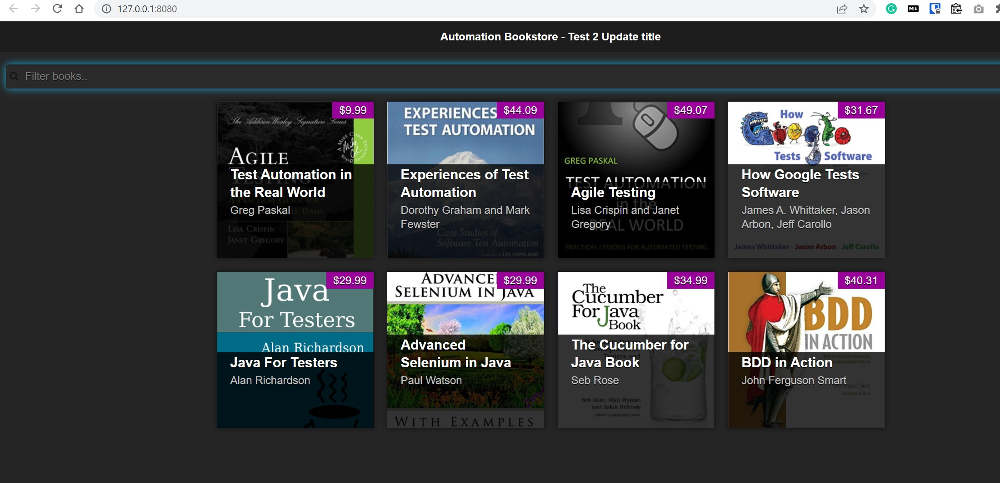
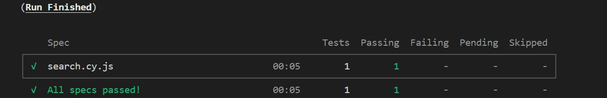

## About

Sample application for test automation.

Site is deployed at https://automationbookstore.dev (https://mzinbookstore-linux.azurewebsites.net) or can be downloaded and used locally.


## Installation 

```
git clone https://github.com/MaksimZinovev/automation-bookstore.git
```

## Usage 

To run tests locally

1. install live server 

```shell
npm install live-server -g
```

Run the website 

```shell
live-server
```

2. Check in your browser http://127.0.0.1:8080/. Website should be accessible 
3. Install Cypress
To install dependencies 

```
cd e2e-tests/
npm install
```

If you want to init new npm project
```shell
cd e2e-tests
npm init -y
npm install cypress
npx cypress open

```
Follow propmpts and complete setup for Chrome. 
Run `search.cy.js` in Cypress app to check if it is working.

1. Run cypress tests from CLI

```shell
npx run cypress
```


  

